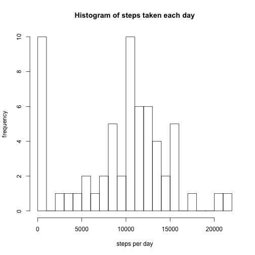
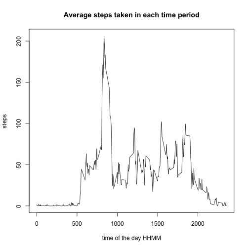
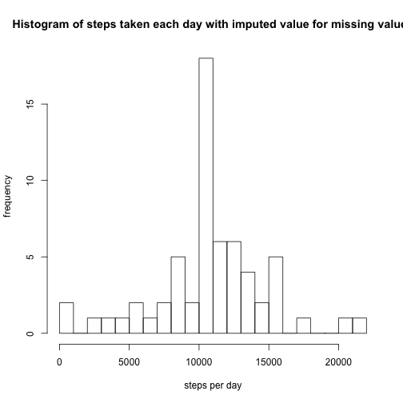
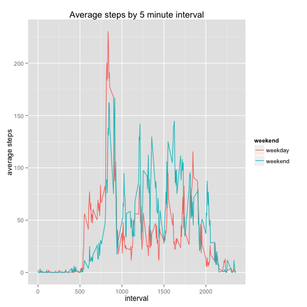

# Reproducible Research Assingment
## Loading and preprocessing the data
The data file is assumed to be in the working directory. The date variable will be converted into POSIX


```r
data <- read.csv("activity.csv", stringsAsFactors = F)
data$date <- as.POSIXct(data$date, format = "%Y-%m-%d", tz = "UTC")
```

## What is mean total number of steps taken per day?
*Make a histogram of the total number of steps taken each day*


```r
q1 <- tapply(data$steps, data$date, sum, na.rm=T)
hist(q1, breaks=20, main = "Histogram of steps taken each day",
     xlab = "steps per day", ylab = "frequency")
```

 

2. *Calculate and report the mean and median total number of steps taken per day*

```r
mean_steps <- mean(q1)
mean_steps
```

```
## [1] 9354.23
```

```r
median_steps <- median(q1)
median_steps
```

```
## [1] 10395
```
The mean and median of steps taken per day are **9354.23** and **10395** respectively


## What is the average daily activity pattern?
*Make a time series plot (i.e. type = "l") of the 5-minute interval (x-axis) and the average number of steps taken, averaged across all days (y-axis)*

```r
q2 <- tapply(data$steps, data$interval, mean, na.rm=T)
interval <- unique(data$interval)
plot(x = interval, y= q2, type="l",
     main = "Average steps taken in each time period",
     xlab = "time of the day HHMM",
     ylab = "steps")
```

 

*Which 5-minute interval, on average across all the days in the dataset, contains the maximum number of steps?*

```r
max_interval <- interval[q2==max(q2)]
max_interval
```

```
## [1] 835
```
It was **835** when they had maximum number of steps

## Imputing missing values
*Calculate and report the total number of missing values in the dataset (i.e. the total number of rows with NAs)*

```r
missing <- is.na(data$steps)
missing_num <- sum(missing)
```
The total number of missing values in the dataset was **2304**


*Devise a strategy for filling in all of the missing values in the dataset. The strategy does not need to be sophisticated. For example, you could use the mean/median for that day, or the mean for that 5-minute interval, etc.*  

Missing data will be **replaced by mean of the corresponding 5-minute interval**  

*Create a new dataset that is equal to the original dataset but with the missing data filled in.*

```r
missingPeriods <-data[missing==TRUE,"interval"]
MeanTable <- cbind(interval,q2)
imputedData <- MeanTable[match(missingPeriods, MeanTable),2]
DT <- data
DT[missing==T, "steps"] <- imputedData
```
  
*Make a histogram of the total number of steps taken each day and Calculate and report the mean and median total number of steps taken per day. Do these values differ from the estimates from the first part of the assignment? What is the impact of imputing missing data on the estimates of the total daily number of steps?*  

```r
dailyStepsImputed <- tapply(DT$steps, DT$date, sum, na.rm=T)

hist(dailyStepsImputed, breaks=20, main = "Histogram of steps taken each day with imputed value for missing values",
     xlab = "steps per day", ylab = "frequency")
```

 

```r
daily_mean <- mean(dailyStepsImputed)
daily_mean
```

```
## [1] 10766.19
```

```r
daily_median <- median(dailyStepsImputed)
daily_median
```

```
## [1] 10766.19
```
The mean is **10766.19** and the median is **10766.19**  

values are missed by day, i.e. values are missed for the entire day when they are missed, and therefore daily totals added by imputed 5-minute values are all the same as the average daily steps. Therefore, the distribution curve will be much higher in the middle and the median and the mean converge.

## Are there differences in activity patterns between weekdays and weekends?
*Create a new factor variable in the dataset with two levels – “weekday” and “weekend” indicating whether a given date is a weekday or weekend day.*

```r
weekend <- c("Saturday", "Sunday")
weekendTable <- cbind(c(TRUE,FALSE),c("weekend", "weekday"))
DT$weekendFlag <- weekendTable[match(weekdays(DT[,"date"]) %in% weekend, weekendTable),2]
```

*Make a panel plot containing a time series plot (i.e. type = "l") of the 5-minute interval (x-axis) and the average number of steps taken, averaged across all weekday days or weekend days (y-axis).*

```r
weekEndDT <- DT[DT$weekendFlag == "weekend",]
weekDayDT <- DT[DT$weekendFlag == "weekday",]
weekEndAverages <- tapply(weekEndDT$steps, weekEndDT$interval, mean, na.rm=T)
weekDayAverages <- tapply(weekDayDT$steps, weekDayDT$interval, mean, na.rm=T)

wkEdt <- as.data.frame(cbind(interval, weekEndAverages), stringAsFactors=F)
wkDdt <- as.data.frame(cbind(interval, weekDayAverages), stringsAsFactors=F)
wkEdt$wk <- "weekend"
wkDdt$wk <- "weekday"
cNames <- c("interval", "meanSteps", "weekend")
colnames(wkEdt) <- cNames
colnames(wkDdt) <- cNames
graphData <- rbind(wkEdt, wkDdt)

library(ggplot2)
gData <- ggplot(graphData, aes(interval, meanSteps))
pData <- gData + geom_line(aes(color = weekend)) + labs(title = "Average steps by 5 minute interval", 
                                                        x = "interval",
                                                        y = "average steps")

print(pData)
```

 
